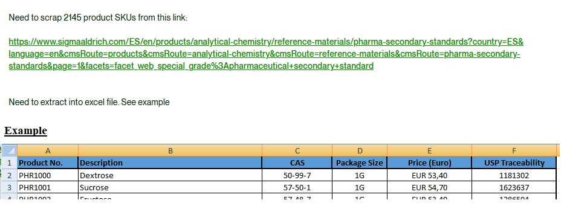

## Проект для сбора данных эталонных материалов для фармацевтической промышленности

## Описание

Этот проект представляет собой скрипт на Python для сбора данных о продуктах в области аналитических исследований 
для фармацевтической промышленности с веб-сайта. Скрипт использует библиотеку requests для отправки HTTP-запросов, 
JSON для обработки данных и библиотеки pandas для работы с данными. Для параллельного выполнения запросов и ускорения 
процесса сбора данных используется библиотека concurrent.futures. Он извлекает информацию о продуктах, 
их характеристиках, ценах и других параметрах, а затем сохраняет эти данные в форматах Excel и JSON.

## Задача

## Функционал

1. Сбор данных по страницам: Скрипт отправляет HTTP-запросы к веб-сайту с заданными параметрами для получения данных о продуктах.

2. Обработка и сохранение данных: Полученные данные обрабатываются и сохраняются в формате CSV (`product_data.csv`) и 
JSON (`product_data.json`).

## Использование

1. Установите необходимые библиотеки, если они еще не установлены. Вы можете использовать команду 
   `pip install -r requirements.txt` для установки библиотек, указанных в файле requirements.txt.

2. Запустите скрипт, выполнив команду:

   > python pars_sigmaaldrich_website.py

Скрипт начнет сбор данных о продуктах. По умолчанию, скрипт обрабатывает определенное количество страниц.

3. По завершении выполнения скрипта, данные будут сохранены в файлах `product_data.csv` и `product_data.json`.

## Параметры конфигурации

Вы можете настроить параметры скрипта, изменяя значения в коде, такие как URL веб-сайта, количество потоков, 
параметры запросов и другие.

## Зависимости

Для работы скрипта необходимы следующие библиотеки:

- requests для отправки HTTP-запросов.
- pandas для работы с данными в формате CSV и JSON.
- re для обработки текстовых данных с использованием регулярных выражений.
- json для работы с данными в формате JSON.
- concurrent.futures для параллельного выполнения запросов, что повышает эффективность сбора данных.

Убедитесь, что вы установили эти библиотеки перед запуском скрипта.

## Примечания

Этот скрипт предназначен только для образовательных целей.